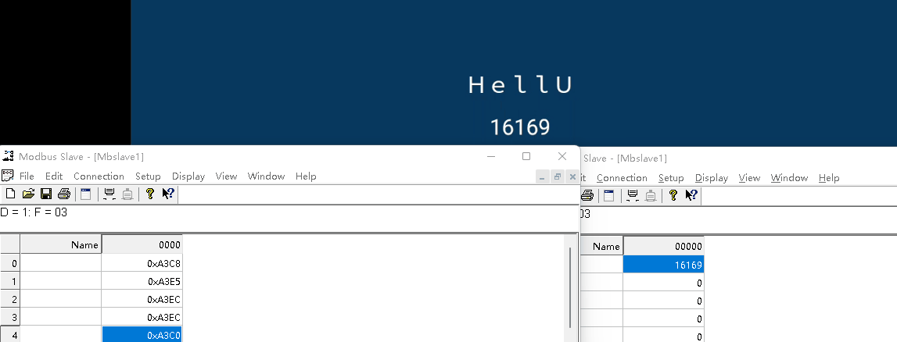

# **KModbus**

<p>
    
</p>

- **Support Rtu、Tcp、Ascii**
- **Built-in polling and reconnection processing mechanism**
- **[Refer to GB2312 code](https://www.khngai.com/chinese/charmap/tblgb.php?page=0)**

```kotlin
repositories { mavenCentral() }

// Remote dependencies have not been updated at this time
implementation("com.kotlincrow.android.component:KModbus:1.1")

/*
It is recommended that you use an aar file, which contains the so dynamic library by default! 
You don’t need to import it additionally, it can be found in Release

Local aar file path : app/libs/KModbus-1.3.aar
 */

implementation(files("libs/KModbus-1.3.aar"))
```

|                                                                      |
|:-----------------------------------------------------------------------------------------------------:|
| Left->Tcp 1000ms (HoldingRegisters - GB2312 - String)  /  Right ->Rtu 50ms (HoldingRegisters - Int16) |

```kotlin
class MainActivity : AppCompatActivity() {

    private val mBinding by lazy { ActivityMainBinding.inflate(layoutInflater) }
    private val mKModbusRtu = KModbusRtu()
    private val mKModbusTcpClient = KModbusTcpClient()
    private val mKModbusTcpServer = KModbusTcpServer()
    private val mKModbusAscii = KModbusAscii()

    override fun onDestroy() {
        super.onDestroy()
        // Clear all context to prevent any references. You can also continue to use the object after clearing it to continue your tasks later.
        mKModbusRtu.cancelAll()
        mKModbusAscii.cancelAll()

        // When you clear all tasks, kmodbus tcp be forcibly terminated even if the reconnection is configured
        // When you use a tcp instance to start multiple clients and servers, and you call cancelAll, all tasks in the instance will be stopped
        mKModbusTcpClient.cancelAll()
        mKModbusTcpServer.cancelAll()
    }

    override fun onCreate(savedInstanceState: Bundle?) {
        super.onCreate(savedInstanceState)
        setContentView(mBinding.root)

        /*
                // You can start a server with multiple ports from a single TCP instance
                initTcpSlave(port = 8080)
                initTcpSlave(port = 8081, isCancelDelay = true)
        
                // You can start tasks with different IP addresses or ports through a TCP instance
                initTcpMaster("192.168.1.102", 8080)
                initTcpMaster("192.168.1.102", 8081, isCancelDelay = true)
        
                // You can open different serial ports by constructing multiple KModbusRtu, the same goes for TCP and ASCII
                initRtuMaster(ttySNumber = 3, BaudRate.S_9600)
                initRtuSlave(ttySNumber = 0, BaudRate.S_9600)
                initAsciiMaster(ttySNumber = 3, BaudRate.S_9600)
        */


        // kmodbus tcp msater support multiple client connection
        /*
                initTcpMaster(host = "192.168.1.102", port = 8080)
                initTcpMaster(host = "192.168.1.102", port = 8080)
                initTcpMaster(host = "192.168.1.102", port = 8080)
                val clinetJob = initTcpMaster(host = "192.168.1.102", port = 8080)
                lifecycleScope.launch {
                    delay(3000L)
        
                    // If you cancel the kmodbus TCP job, regardless of whether you have the reconnection mechanism enabled or not, this will be invalid and the TCP connection will be closed
                    clinetJob.cancel()
                }
        */
    }

    /**
     * ⦁ Enable rtu slave mode.
     *
     * ⦁ 2024-04-26 09:42:53 
     * @author crowforkotlin
     */
    private fun initRtuSlave(ttySNumber: Int, baudRate: Int) {
        // I'm too lazy to continue to optimize for RTU refactoring, so for now I can only set up, listener, and start like this....
        mKModbusRtu.apply {
            openSerialPort(ttysNumber = ttySNumber, baudRate = baudRate, parity = SerialPortParityFunction.NONE, stopBit = 1, dataBit = 8)

            addOnSlaveReceiveListener { slaveResp ->
                runCatching {
                    slaveResp.mValues?.let { value ->
                        when(slaveResp.mFunction) {
                            KModbusFunction.WRITE_SINGLE_COIL -> {
                                val coilVal = value.toInt32Data(index = 0, length = 2) ?: 0
                                val coilBoolVal = coilVal < 0
                                "coilsVal is ${coilBoolVal}".info()
                            }
                            KModbusFunction.WRITE_MULTIPLE_COILS -> {
                                val coilsVal = value.splitInt8ToBits(reverse = true)
                                "coilsVal is ${coilsVal.toList()}".info()
                            }
                            KModbusFunction.WRITE_MULTIPLE_REGISTERS -> {
                                val registersVal = value.toInt32Data(index = 0, length = 2) ?: 0
                                "registersVal is $registersVal".info()
                            }
                            else -> {
                                // TODO Maybe is read error ??? ...
                            }
                        }
                    }
                }
            }

            startRepeatReceiveDataTask(KModbusType.SLAVE)
        }
    }

    /**
     * ⦁ Enable tcp slave mode
     *
     * ⦁ 2024-04-26 09:46:33 
     * @author crowforkotlin
     */
    private fun initTcpSlave(port: Int, isCancelDelay: Boolean = false) {
        mKModbusTcpServer.apply{
            tcpServer(port) { ins, ops, clientJob, serverJob ->
                continuouslyReadData(ins, ops, clientJob,KModbusType.SLAVE) { slaveResp ->
                    slaveResp.mValues?.let { value ->
                        when(slaveResp.mFunction) {
                            KModbusFunction.WRITE_MULTIPLE_COILS -> {
                                "tcp slave resp value : ${value.splitInt8ToBits(reverse = true).toList()}".info()
                            }
                            KModbusFunction.WRITE_SINGLE_COIL -> {
                                "tcp slave resp value : ${value.splitInt8ToBits(reverse = true).toList()}".info()
                            }
                            else -> { }
                        }
                        "tcp slave resp : $slaveResp".info()
                        "--------- tcp slave receive end ---------".info()
                    }

                    // You can cancel the TCP server of the current instance, and the reconnection will be invalid. You have to re-execute the tcpServer function
                    if (isCancelDelay) {
                        lifecycleScope.launch {
                            delay(5000)
                            serverJob.cancel()
                        }
                    }
                }
            }
        }
    }

    /**
     * ⦁ Enable tcp master
     *
     * ⦁ 2024-04-26 10:01:16 
     * @author crowforkotlin
     */
    private fun initTcpMaster(host: String, port: Int, isCancelDelay: Boolean = false): Job {
        mKModbusTcpClient.apply{
            return tcpClient(KModbusTcpClient.ClientInfo(host, port) { ins, ops, clientInfo, clientJob ->
                val receiveJob = continuouslyReadData(clientInfo, clientJob, ins, KModbusType.MASTER) { slaveResp ->
                    runCatching {
                        val content = slaveResp.mValues.toInt32Data(index = 0, length = 2).toString()
                        "tcp master port is : ${clientInfo.mPort} \t content is : $content".info()
                        lifecycleScope.launch {
                            mBinding.tcp.text = content
                        }
                    }
                }
                val writeJob = continuouslyWriteData(clientInfo, clientJob, ops, interval = 1000L, timeOut = 1000L) {
                    listOf(
                        buildMasterOutput(KModbusFunction.READ_HOLDING_REGISTERS, 1, 5, 1),
                        buildMasterOutput(KModbusFunction.READ_HOLDING_REGISTERS, 1, 6, 1),
                        buildMasterOutput(KModbusFunction.READ_HOLDING_REGISTERS, 1, 7, 1)
                    )
                }
                if (isCancelDelay) {
                    lifecycleScope.launch {
                        delay(5000)

                        // If you want to cancel a single tcpClient task, you can use clientJob.cancel() in the tcpclient scope
                        clientJob.cancel()
                    }
                }

                // Remember to return your TCP task to the client so that it can handle the exception correctly or reconnect
                listOf(receiveJob, writeJob)
            })
        }
    }

    private fun initRtuMaster(ttySNumber: Int, baudRate: Int) {
        mKModbusRtu.apply {
            // The openSerialPort function has multiple overloads. You can customize the incoming control, serial port, baud rate, check mode, stop bit, and data bit.
            openSerialPort(ttysNumber = ttySNumber, baudRate = baudRate, parity = SerialPortParityFunction.NONE, stopBit = 1, dataBit = 8)

            // Set the listener for data returned from the slave station in master mode
            addOnMasterReceiveListener { arrays ->
                runCatching {
                    // No matter what data is written, as long as the parsed data is empty, it is incorrect!
                    arrays.info()
                    val resp: KModbusRtuMasterResp = resolveMasterResp(arrays, ModbusEndian.ABCD) ?: return@addOnMasterReceiveListener

                    // Even if the data is parsed, it's possible that mValues will be null, and that's because the modbus slave will return a successful response by default!
                    val content: Long = resp.mValues.toInt32Data(index = 0, length = 2) ?: return@runCatching
                    lifecycleScope.launch {
                        mBinding.rtu.text = content.toString()
                    }
                }
                "Rtu : ${resolveMasterResp(arrays, ModbusEndian.ABCD)}".info()
            }

            // If you want to poll and write multiple data, you can add the data to the queue in the same way as listOf.
            setOnDataWriteReadyListener { listOf(buildMasterOutput(READ_HOLDING_REGISTERS, 1, 0, 1)) }

            // Set the reading behavior to: master mode. If it is slave mode, it means that the data sent by the master station will be read.
            startRepeatReceiveDataTask(kModbusBehaviorType = KModbusType.MASTER)

            /*writeData(mKModbusRtu.buildMasterOutput(
                function = KModbusFunction.READ_HOLDING_REGISTERS,
                slaveAddress = 1,
                startAddress = 1,
                count = 2,
                value = 4
            ))*/
            // Enable polling tasks for writing data, with built-in timeout mechanism
            startRepeatWriteDataTask(interval = 1000L, timeOut = 1000L) { "Rtu Time out!".info() }

            // If you do not enable polling writing, you can also manually control the writing of data yourself.
            /* mKModbusRtu.writeData(buildMasterOutput(
                 function = KModbusFunction.WRITE_SINGLE_REGISTER,
                 slaveAddress = 6,
                 startAddress = 0,
                 count = 2,
                 value = 0
             )) */
        }
    }

    /**
     * ⦁ Enable rtu ascii master
     *
     * ⦁ 2024-04-26 10:01:42 
     * @author crowforkotlin
     */
    private fun initAsciiMaster(ttySNumber: Int, baudRate: Int) {
        mKModbusAscii.apply {
            openSerialPort(ttySNumber, baudRate)
            addOnMasterReceiveListener { arrays -> "Ascii : ${arrays.toHexList()}".info() }
            setOnDataWriteReadyListener { listOf(buildMasterOutput(READ_HOLDING_REGISTERS, 1, 0, 1)) }
            startRepeatReceiveDataTask(KModbusType.MASTER)
            startRepeatWriteDataTask(interval = 1000L, timeOut = 1000L) { "Ascii time out!".info() }
        }
    }
}
```

```kotlin 
fun main() {
    // If you want to write floating point data to a register
    KModbusRtu().buildMasterOutput(
        function = KModbusFunction.WRITE_HOLDING_REGISTERS,
        slaveAddress = 1,
        startAddress = 1,
        count = 2,
        values = 123.789f.toIntArray()
    )
}
```

[Docs Here](https://www.kotlincrow.com/2023/10/07/Modbus/): 